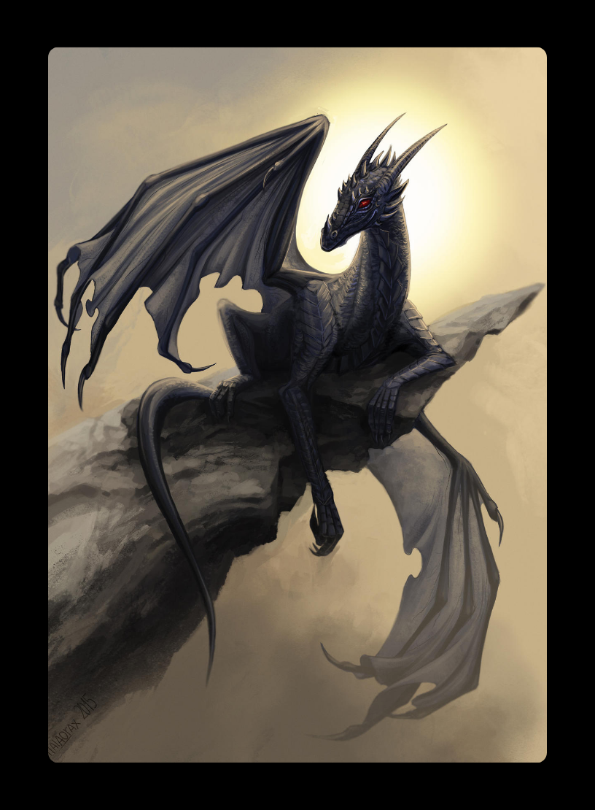

# Deck Vieux Noir
**Auteur :** Un vieux  
**Categorie :** KARUTA  
**Type :** NORMAL  

Un des deux premiers deck de Karuta !   

**Couverture :**  
  

## Liste des cartes :
### [01 - tomorrow](https://naedist.animemusicquiz.com/u2kngn.mp3)
&emsp;**Anime :** [Full Metal Panic!](https://anilist.co/anime/71) - OP1  
&emsp;**Artiste(s) :** Mikuni Shimokawa  

  

### [02 - Boku no Kotoba de wa Nai Kore wa Boku-tachi no Kotoba](https://naedist.animemusicquiz.com/897i3g.mp3)
&emsp;**Anime :** [The Heroic Legend of Arslan](https://anilist.co/anime/20935) - OP1  
&emsp;**Artiste(s) :** UVERworld  

  

### [03 - Netsujou no Spectrum](https://naedist.animemusicquiz.com/xw7mdt.mp3)
&emsp;**Anime :** [The Seven Deadly Sins](https://anilist.co/anime/20789) - OP1  
&emsp;**Artiste(s) :** Ikimono-gakari  

  

### [04 - Hikaru Nara](https://naedist.animemusicquiz.com/d3oasy.mp3)
&emsp;**Anime :** [Your lie in April](https://anilist.co/anime/20665) - OP1  
&emsp;**Artiste(s) :** Goose house  

  

### [05 - Cry for the Truth](https://naedist.animemusicquiz.com/8ickql.mp3)
&emsp;**Anime :** [Rokka -Braves of the Six Flowers-](https://anilist.co/anime/20955) - OP1  
&emsp;**Artiste(s) :** MICHI  

  

### [06 - JoJo ~Sono Chi no Sadame~](https://naedist.animemusicquiz.com/fk2kfw.mp3)
&emsp;**Anime :** [JoJo's Bizarre Adventure](https://anilist.co/anime/14719) - OP1  
&emsp;**Artiste(s) :** Hiroaki TOMMY Tominaga  

  

### [07 - FLAT](https://naedist.animemusicquiz.com/yfli89.mp3)
&emsp;**Anime :** [Hamatora](https://anilist.co/anime/20521) - OP1  
&emsp;**Artiste(s) :** livetune adding Yuuki Ozaki (from Galileo Galilei)  

  

### [08 - FALLING DOWN](https://naedist.animemusicquiz.com/xftldk.mp3)
&emsp;**Anime :** [Eden of the East](https://anilist.co/anime/5630) - OP1  
&emsp;**Artiste(s) :** OASIS  

  

### [09 - Un Monde Sans Danger](https://www.youtube.com/watch?v=c58zKvmtLJQ)
&emsp;**Anime :** [Code Lyoko](https://anilist.co/anime/0) - OP1  
&emsp;**Artiste(s) :** Franck Keller  

  

### [10 - Trigger](https://naedist.animemusicquiz.com/zhzj39.mp3)
&emsp;**Anime :** [Terror in Resonance](https://anilist.co/anime/20661) - OP1  
&emsp;**Artiste(s) :** Yuuki Ozaki(from Galileo Galilei)  

  

### [11 - THE HERO !! ~Ikareru Kobushi ni Hi o Tsukero~](https://naedist.animemusicquiz.com/cz0ubn.mp3)
&emsp;**Anime :** [One-Punch Man](https://anilist.co/anime/21087) - OP1  
&emsp;**Artiste(s) :** JAM Project  

  

### [12 - GATE~Sore wa Akatsuki no You ni~](https://naedist.animemusicquiz.com/ndr8fr.mp3)
&emsp;**Anime :** [Gate](https://anilist.co/anime/20994) - OP1  
&emsp;**Artiste(s) :** Kishida Kyoudan &THE Akeboshi Rockets  

  

### [13 - Mune ga Dokidoki](https://naedist.animemusicquiz.com/67u5sw.mp3)
&emsp;**Anime :** [Détective Conan](https://anilist.co/anime/235) - OP1  
&emsp;**Artiste(s) :** THE HIGH-LOWS  

  

### [14 - Sirius](https://naedist.animemusicquiz.com/ph507f.mp3)
&emsp;**Anime :** [Kill la Kill](https://anilist.co/anime/18679) - OP1  
&emsp;**Artiste(s) :** Eir Aoi  

  

### [15 - Rising Hope](https://naedist.animemusicquiz.com/wh1q2x.mp3)
&emsp;**Anime :** [The Irregular at Magic High School](https://anilist.co/anime/20458) - OP1  
&emsp;**Artiste(s) :** LiSA  

  

### [16 - Connect](https://naedist.animemusicquiz.com/k3y6nh.mp3)
&emsp;**Anime :** [Puella Magi Madoka Magica](https://anilist.co/anime/9756) - OP1  
&emsp;**Artiste(s) :** ClariS  

  

### [17 - GUARDIAN ANGEL(XAVIER'S EDIT)](https://naedist.animemusicquiz.com/pb7y5l.mp3)
&emsp;**Anime :** [Texhnolyze](https://anilist.co/anime/26) - OP1  
&emsp;**Artiste(s) :** JUNO REACTOR  

  

### [18 - Mazeru na Kiken](https://naedist.animemusicquiz.com/4dbck5.mp3)
&emsp;**Anime :** [Ushio and Tora](https://anilist.co/anime/21038) - OP1  
&emsp;**Artiste(s) :** Kinniku Shoujo-tai  

  

### [19 - Baikai](https://naedist.animemusicquiz.com/m3lzkg.mp3)
&emsp;**Anime :** [Paprika](https://anilist.co/anime/1943) - OP1  
&emsp;**Artiste(s) :** Susumu Hirasawa  

  

### [20 - Tabi no Tochuu](https://naedist.animemusicquiz.com/1kmdzi.mp3)
&emsp;**Anime :** [Spice and Wolf](https://anilist.co/anime/2966) - OP1  
&emsp;**Artiste(s) :** Natsumi Kiyoura  

  

### [21 - Shiny tale](https://naedist.animemusicquiz.com/c87oui.mp3)
&emsp;**Anime :** [Daily Lives of High School Boys](https://anilist.co/anime/11843) - OP1  
&emsp;**Artiste(s) :** Mix Speaker's,Inc.  

  

### [22 - oath sign](https://naedist.animemusicquiz.com/ug35r2.mp3)
&emsp;**Anime :** [Fate/Zero](https://anilist.co/anime/10087) - OP1  
&emsp;**Artiste(s) :** LiSA  

  

### [23 - One Reason](https://naedist.animemusicquiz.com/5hz692.mp3)
&emsp;**Anime :** [Deadman Wonderland](https://anilist.co/anime/6880) - OP1  
&emsp;**Artiste(s) :** DWB feat. fade  

  

### [24 - Bravely You](https://naedist.animemusicquiz.com/gdvka1.mp3)
&emsp;**Anime :** [Charlotte](https://anilist.co/anime/20997) - OP1  
&emsp;**Artiste(s) :** Lia  

  

### [25 - Chase the world](https://naedist.animemusicquiz.com/45cd9t.mp3)
&emsp;**Anime :** [Accel World](https://anilist.co/anime/11759) - OP1  
&emsp;**Artiste(s) :** May'n  

  

### [26 - Dadada](https://naedist.animemusicquiz.com/fpiny6.mp3)
&emsp;**Anime :** [Beelzebub](https://anilist.co/anime/9513) - OP1  
&emsp;**Artiste(s) :** Group Tamashii  

  

### [27 - Clattanoia](https://naedist.animemusicquiz.com/3efzdr.mp3)
&emsp;**Anime :** [Overlord](https://anilist.co/anime/20832) - OP1  
&emsp;**Artiste(s) :** OxT  

  

### [28 - Oshiete A to Z](https://naedist.animemusicquiz.com/g5b9gy.mp3)
&emsp;**Anime :** [Yamada's First Time: B Gata H Kei](https://anilist.co/anime/7817) - OP1  
&emsp;**Artiste(s) :** Yukari Tamura  

  

### [29 - Re:Re:](https://naedist.animemusicquiz.com/zoq0ul.mp3)
&emsp;**Anime :** [ERASED](https://anilist.co/anime/21234) - OP1  
&emsp;**Artiste(s) :** ASIAN KUNG-FU GENERATION  

  

### [30 - Bikini Warriors ED](https://www.youtube.com/watch?v=-hTywo0L5tA)
&emsp;**Anime :** [Bikini Warriors](https://anilist.co/anime/21192) - ED1  
&emsp;**Artiste(s) :** unknown  

  

